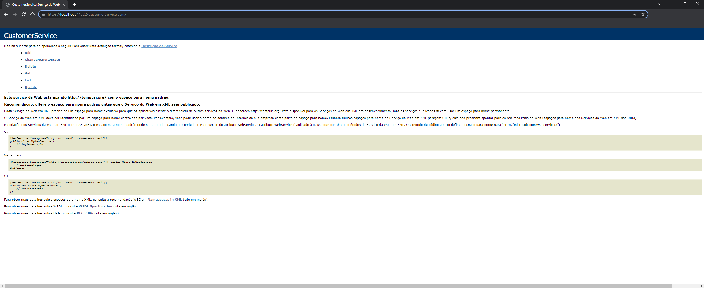
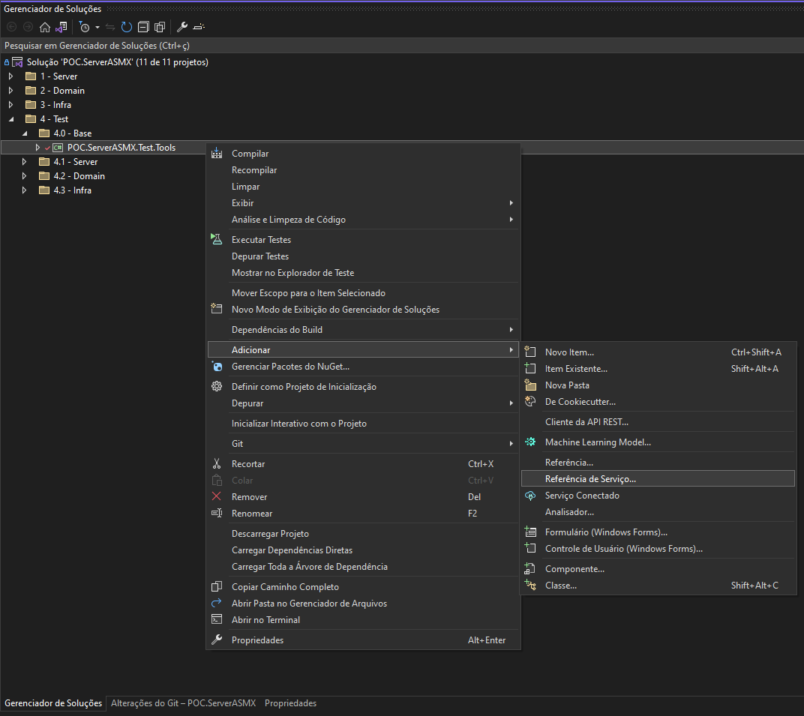
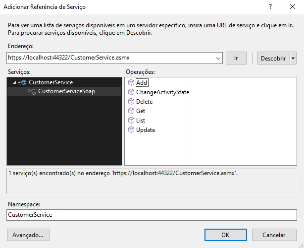
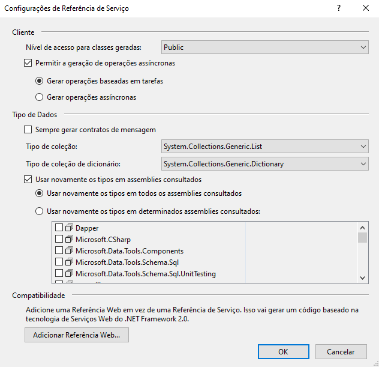

# Adding service reference (Soap)

1. Copy the url of the desired soap service

   

2. Right-click on the desired project and add a new service reference.

   

3. Fill in the fields according to the image.

   

4. Fill in the fields according to the image.

   